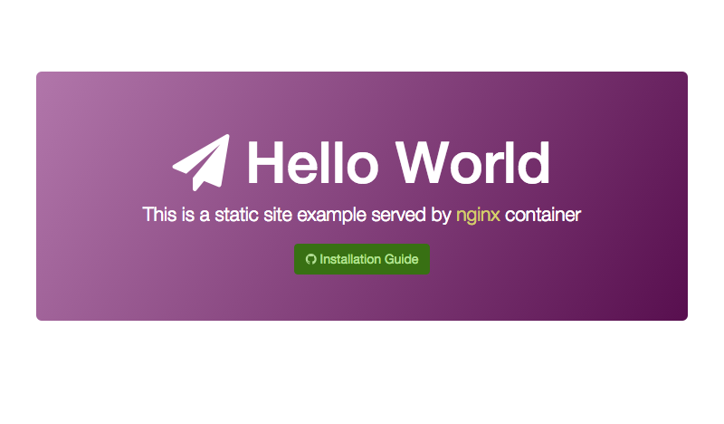

# On-Premise Installation

Hello-world is a simple web server.

# Preparing environment

Hello-world requires docker to be installed on the machine. Check [Docker Installation](https://docs.docker.com/installation/) page to prepare your environment before continuing. 

After your done with installation you can validate everything is ok by doing the following:

```shell
$ docker version
```

If everything is ok, it should return information about your installed docker version.

# Downloading the Container Image

After signing up you will receive a `config.json` file with the credentials for the repository. Save this file to `~/.docker/config.json` in your production machine.

# Launching Hello World

